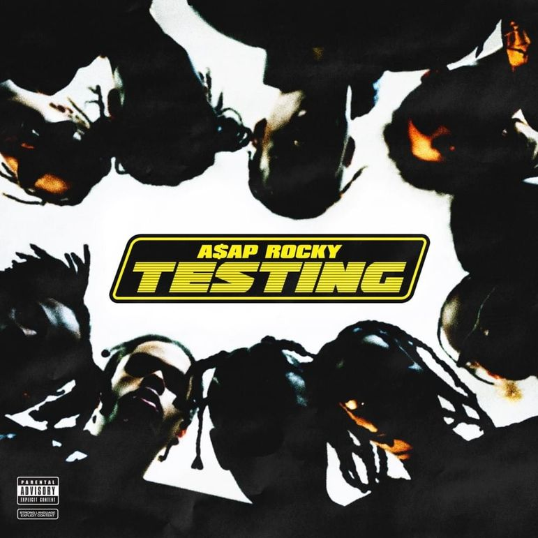

# 21년 1월 18일

1. 스프링 시큐리티 강좌 보기

2. API 구현 마무리 ( payment )

> 1. 프로필 사진 바꾸기
> 2. user 승인
> 3. dotvideo 전송 -> send email / 직접전송

3. 회원가입/관리쪽 API 점검

4. canvas api 구현

* canvas 구현 되면 -> payment - canvas연결 + 아티스트한테 돈이 걸려있는게 아니라, canvas에 돈이 걸려있게 변경

5. 오픽 노잼 강좌 마무리

6. 오픽 스크립트 쓰기

# 21년 1월 19일

1. 회의 안건

> 발송중 용어?

{: width="20" height="20"}